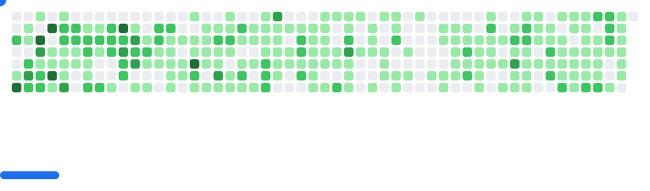

 

`Fullstack Developer` `Student` `Building things that matter`

 

---

### About

<table>
  <tr>
    <td>
      I'm Angel Josue Loayza Huarachi — a fullstack developer currently working with <b>Next.js</b> professionally while specializing in <b>Angular</b> and <b>NestJS</b> on my own projects. Still finishing my degree, but already shipping production code.
    </td>
    <td>
      
    </td>
  </tr>
</table>

---

### Tech Stack

**Languages**

**Frontend**

**Backend**

**Tools**

---

### GitHub Stats

  
  

  

---

<picture>
  <source media="(prefers-color-scheme: dark)" srcset="images/breakout-dark.svg" />
  <source media="(prefers-color-scheme: light)" srcset="images/breakout-light.svg" />
  
</picture>
